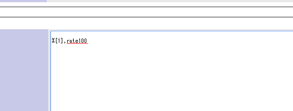

# Mantis Plugin ImagePasteOnComment .
Mantis Plugin Mantis_ImagePasteOnComment .

# Requirements
Mantis bt 1.3.0 higher.

This plugin require high priority than 'MantisBT Core Formatting'.

# Usage
To write comment with this.
---
%[file_id],rate100
---

file_id is below example.

http://example.com/mantis/file_download.php?file_id=1&type=bug

rate100 is 100% width at comment field.

# Description
This is the plug-in for putting the images into the commentation.
Because Patch1.2.0series did not have "EVENT_VIEW_BUG_ATTACHMENT" as a event, we add such function in Patch1.3.0 series. We added branch on mantisbt12.

The images which uploaded to MantisBT, has its own ID, the preview of images will  be shown same width as the comment size if you write down that ID on %[file_id].

## About Rate

Rate 100 means the width 100%.the aspect ratio keeps its rate as when the image is uploaded. If you want to change the vertical size, you should look for other plug-in.(the patch is made by who would not be bothered to adjust the size finely as long as the width is right size)

we suggest that it would be much simpler if you define the changing rate as rate10,rate30,rate70,rate100,rate150

## Priolity of the Plug-in

because this Plug-in expand the MantisBT CoreFormatting, it needs the MantisBT CoreFormatting. But if the priolity number is same as the MantisBT Core, then the image would not be shown.
thus the priolity number of this plug-in should be smaller than MantisBT CoreFormatting.

## Function for adding the images to text area

the list of the images will be shown when the image file is uploaded,
then click the area of blue coloured word "Click this", then %[1],rate100 will be enterd automatically.

# 説明
英語は下手なので日本語でざっくりと説明すると、
アップロードした画像をコメントの部分に張り込めるプラグインです。
1.2.0系では「EVENT_VIEW_BUG_ATTACHMENT」のイベントがなかったので、1.3.0系にしました。
branchをmantisbt12に分けています。

MantisBTのアップロードされた画像は固有のIDがついているので
それを%[file_id]の部分に書き込んでもらえれば、プレビュー画像を
コメントの幅に併せて表示してくれます。

## rateについて
rate100っていうのは、幅100％です。縦横比率はアップロードされたままを
保持しますので、高さを変えたいという人は他のプラグインを探してください。
（幅さえ合っていれば、細かい調整をしたくないというずぼらな人間が作っています)

rate10,rate30,rate70,rate100,rate150など、変化させる値も大体こういう数字と
決めておいたほうが楽だと思います。

## プラグイン優先度
あと、プラグインはMantisBT Coreを拡張しているので必要なのですが、
優先度が同じだと表示されません。このプラグインの優先度の数字を
MantisBT Core Formattingよりも小さくしてください。

例:
  Mantis ImagePasteOnComment  -> 2
  MantisBT Core Formatting    -> 3

## テキストエリアへの挿入機能
画像ファイルをアップロードした後に、ファイル一覧が出ます。

薄い青で「Click this...」と書かれた領域をクリックすると
テキストエリアに%[1],rate100が自動で入ります。

# 改良予定
- 「EVENT_VIEW_BUG_ATTACHMENT」のreturnに文字列を入れているのに
 $p_attachmentの情報が配列として追加されてしまい、$t_prefixにはいって
 表示にArrayがついてしまう。この謎を解きたいが…書き方募集中
- クリックする部分を英語（まともな）と日本語にしたいと思います。

# 募集
- スタイルシートの素敵なサンプル
- 「EVENT_VIEW_BUG_ATTACHMENT」への関数の書き方

# スクリーンショットに出ている画像について
https://jp.fotolia.com/id/51565496

作者：christine krahl

fotoliaにてXS画像を購入して使いました。

# 説明の素敵な英訳
Thanks!!

Kalm@Answerer

# 変更履歴
- 1.0.3 表示文言を一部日本語と英語に変更。
- 1.0.2 ファイルが画像以外の場合、IDのファイルが存在しない場合を追加
- 1.0.1 javascriptをwindow.onload直接呼出しから、AddEventHanderに変更。
- 1.0.0 ある程度の使用に耐えれる状態なので公開開始
