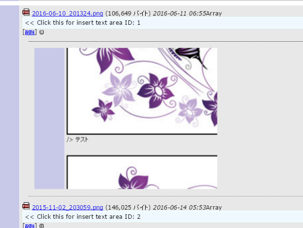

# Mantis_ImagePasteOnComment
Mantis Plugin ImagePasteOnComment develop.

# Requirements
Mantis bt 1.2.0 higher.

This plugin require high priority than 'MantisBT Core'.

# Usage
%[file_id],rate100

file_id is below example.

http://example.com/mantis/file_download.php?file_id=1&type=bug

rate100 is 100% width at comment field.

# 説明
英語は下手なので日本語でざっくりと説明すると、
アップロードした画像をコメントの部分に張り込めるプラグインです。

MantisBTのアップロードされた画像は固有のIDがついているので
それを%[file_id]の部分に書き込んでもらえれば、プレビュー画像を
コメントの幅に併せて表示してくれます。

rate100っていうのは、幅100％です。縦横比率はアップロードされたままを
保持しますので、高さを変えたいという人は他のプラグインを探してください。
（幅さえ合っていれば、細かい調整をしたくないというずぼらな人間が作っています)

rate10,rate30,rate70,rate100,rate150など、変化させる値も大体こういう数字と
決めておいたほうが楽だと思います。

あと、プラグインはMantisBT Coreを拡張しているので必要なのですが、
優先度が同じだと表示されません。このプラグインの優先度の数字を
MantisBT Coreよりも小さくしてください。

# 改良予定
- CSSをプラグインの作法に沿って設置
- 基本機能のプレビュー画像はクリックするとダウンロードですが、
　独自のパッチでコメントフィールドに%[file_id],rate100を挿入するように
　変更してしまいました。プラグインでどのようにしたらよいのかわからないので
　わかり次第加えたいと思います。

# 募集
- 説明の素敵な英訳
- スタイルシートの素敵なサンプル
